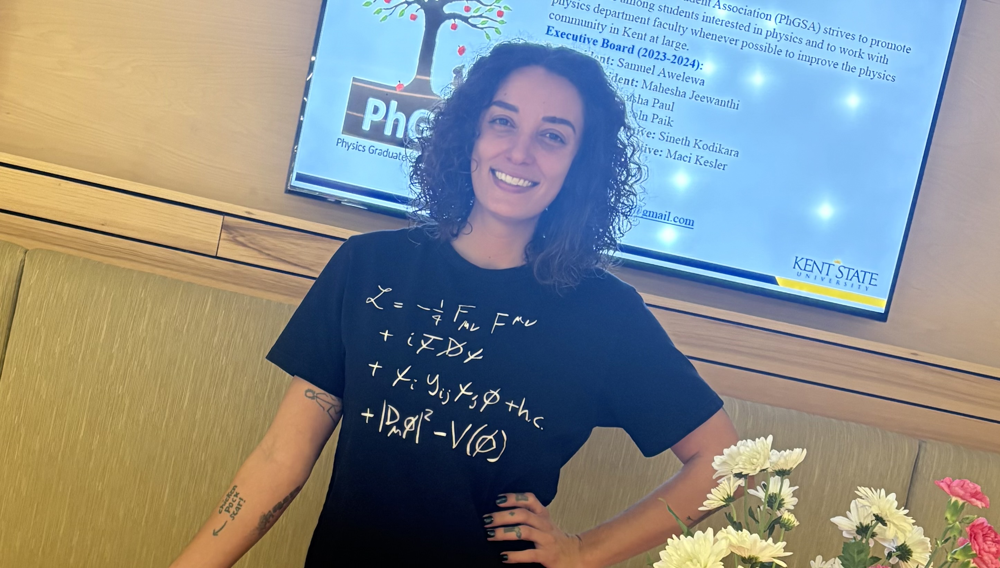

# Welcome

I’m **Maci Kesler**, a 5th year graduate student and advanced researcher in nuclear/particle physics. I'm currently affiliated with Kent State University and  the ePIC, H1, and STAR collaborations. My work focuses on nuclear imaging through diffractive scattering and exclusive vector meson production. 

I primarily develop physics simulations, models, and analysis strategies. I also mentor students in building machine learning architectures to be integrated into physics studies. I really enjoy outreach activities and sharing the excitement of physics with the broader community. I also *hold the high score on three different Ms. Pac-Man machines* across the country!

You can find my CV and an overview of the projects I'm currently working on through the links below.

- [Curriculum Vitae](/cv/)
- [Projects](/projects/)

# Contact

- Email: [macilla3.14159@gmail.com](mailto:macilla3.14159@gmail.com)  
- LinkedIn: [linkedin.com/in/maci-kesler-a45795243](https://linkedin.com/in/maci-kesler-a45795243)  
- GitHub: [github.com/macink](https://github.com/macink)
- Google Scholar: [scholar.google.com/citations?hl=en&user=fBu9LuAAAAAJ](https://scholar.google.com/citations?hl=en&user=fBu9LuAAAAAJ)
- INSPIRE-HEP: [inspirehep.net/authors/2893282](https://inspirehep.net/authors/2893282)
